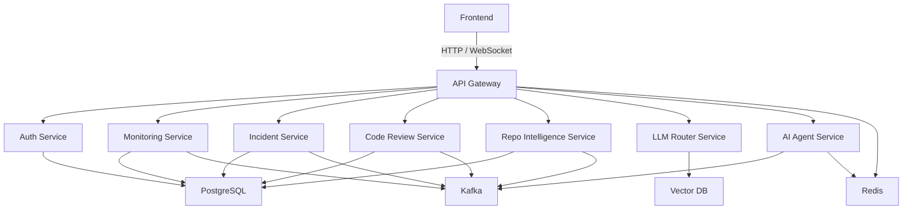

# NexusAI — Enterprise AI-Powered Engineering Operations Platform

NexusAI is a production-scale SaaS platform designed to centralize AI-powered engineering, observability, incident management, and developer productivity.

## Vision

Provide an AI Operating System for software teams that unifies:

- AI Code Review
- Repository Intelligence
- Kubernetes Monitoring
- Incident Root Cause Analysis
- Multi-LLM Routing
- DevOps Automation
- Chaos Engineering
- Predictive Infrastructure Analytics

## Frontend Dashboard

The frontend now includes a polished enterprise operations dashboard built with Next.js and TailwindCSS.

- Responsive sidebar navigation
- Metrics cards for service readiness, incidents, AI review risk, and data schemas
- Backend service contract table for Day 4 APIs
- Day 5 data-layer status for PostgreSQL, Redis, and Qdrant
- Incident and platform event timeline
- Dense enterprise dashboard visual language

## Day 4 Update — Backend Core Setup

The backend foundation now includes runnable Spring Boot skeletons for the API gateway and core microservices.

- API Gateway application entrypoint with route configuration for backend services
- Gateway status endpoint for service discovery and deployment checks
- Auth service health and capability endpoints
- Monitoring service health and platform summary endpoints
- Incident, code review, repo intelligence, LLM router, and AI agent service skeletons
- Baseline application configuration for local service ports, databases, Kafka, and management endpoints

## Day 5 Update — Data Layer Design

The platform now includes persistence contracts for PostgreSQL, Redis, and Qdrant.

- PostgreSQL schemas for auth, monitoring, incidents, code review, repo intelligence, LLM routing, and AI agents
- Docker Compose Postgres initialization for fresh local development volumes
- Redis keyspace contracts for sessions, rate limits, locks, workflow state, and provider health
- Qdrant collection definitions for repository chunks, incident context, and runbook knowledge
- Data-layer documentation in `database/README.md`

## Day 6 Update — Local Docker Development

The platform now has a refined Docker Compose setup for local development.

- Multi-stage Dockerfiles for frontend, Java services, and Python AI services
- Static frontend container served through Nginx on `localhost:3000`
- Compose health checks and service-aware environment variables
- Postgres, Redis, Kafka, Qdrant, API gateway, backend services, AI services, and frontend wired into one stack
- Local runbook in `docs/local-development.md`

## Day 7 Update — Comprehensive Documentation and System Diagrams

Complete documentation and system architecture diagrams for developers and operators.

- **System Diagrams**: High-level architecture, data flows, deployment topology, service interactions, database schemas, and error handling patterns (10 Mermaid diagrams)
- **API Reference**: Complete endpoint documentation with curl examples for all 8 backend services
- **Developer Guide**: Setup instructions, workflows, debugging, database management, and testing procedures
- **Configuration Reference**: All environment variables, feature flags, security settings, and performance tuning
- **Deployment Guide**: Production deployment on Kubernetes, Docker Swarm, and cloud platforms with HA/DR strategies
- **Troubleshooting Guide**: Common issues with solutions for services, databases, caches, performance, and networking
- **Service Details**: Deep dive on responsibilities, data flows, and implementation patterns for each microservice
- **Database Schema**: Complete schema documentation with indexes, constraints, and optimization patterns
- **Security Guide**: Authentication, authorization, data protection, secrets management, compliance, and incident response
- **Contributing Guide**: Workflow, code style, testing requirements, and PR process

## Architecture Overview

## Phase 1 — Foundation & Architecture

### Goals

- Define the platform architecture
- Establish the monorepo structure
- Create core documentation
- Initialize the first services skeletons

### Structure

- `frontend/`
- `api-gateway/`
- `auth-service/`
- `monitoring-service/`
- `incident-service/`
- `code-review-service/`
- `llm-router-service/`
- `repo-intelligence-service/`
- `ai-agent-service/`
- `ai-services/`
- `kubernetes/`
- `terraform/`
- `docs/`

## Getting Started

This workspace is intentionally bootstrapped for a modular enterprise microservices platform.

Next steps:

1. **Quick Start**: Follow `docs/local-development.md` to run NexusAI locally with Docker Compose
2. **API Documentation**: See `docs/api-reference.md` for all endpoint specifications
3. **Architecture**: Review `docs/diagrams.md` for system architecture and data flows
4. **Development**: Check `docs/developer-guide.md` for setup, debugging, and testing
5. **Deployment**: Read `docs/deployment.md` for production deployment strategies

---

## Documentation Index

### User Guides
- **[Local Development](docs/local-development.md)** — Start NexusAI locally with Docker Compose
- **[Developer Guide](docs/developer-guide.md)** — Setup, build, test, and debug services
- **[Troubleshooting](docs/troubleshooting.md)** — Common issues and solutions
- **[Contributing](docs/developer-guide.md#contributing)** — Code style, workflow, PR process

### Technical Documentation  
- **[API Reference](docs/api-reference.md)** — Complete endpoint documentation for all services
- **[Service Details](docs/service-details.md)** — Architecture and implementation of each service
- **[Database Schema](docs/database-schema.md)** — PostgreSQL, Redis, Qdrant schema design
- **[System Diagrams](docs/diagrams.md)** — Architecture, data flows, and deployment topologies

### Operations & Deployment
- **[Deployment Guide](docs/deployment.md)** — Production deployment, scaling, HA/DR
- **[Configuration Reference](docs/configuration.md)** — Environment variables and settings
- **[Security Guide](docs/security.md)** — Authentication, encryption, compliance, incident response

### Service Documentation
- `api-gateway/README.md` — API Gateway service details
- `auth-service/README.md` — Authentication service
- `monitoring-service/README.md` — Monitoring and metrics
- `incident-service/README.md` — Incident management
- `code-review-service/README.md` — AI code review
- `repo-intelligence-service/README.md` — Repository intelligence
- `llm-router-service/README.md` — LLM routing and selection
- `ai-agent-service/README.md` — AI agent orchestration
- `ai-services/README.md` — Python AI utilities
- `database/README.md` — Database initialization and schemas
- `kubernetes/README.md` — Kubernetes deployment manifests
- `terraform/README.md` — Infrastructure-as-code
- `frontend/README.md` — Frontend application

---
