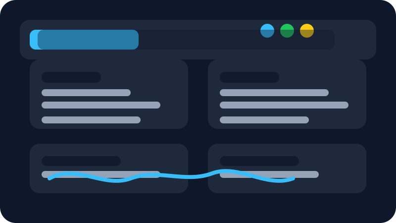
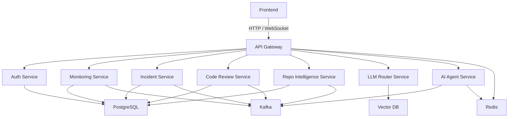

# NexusAI — Enterprise AI-Powered Engineering Operations Platform

NexusAI is a production-scale SaaS platform designed to centralize AI-powered engineering, observability, incident management, and developer productivity.

## Vision

Provide an AI Operating System for software teams that unifies:

- AI Code Review
- Repository Intelligence
- Kubernetes Monitoring
- Incident Root Cause Analysis
- Multi-LLM Routing
- DevOps Automation
- Chaos Engineering
- Predictive Infrastructure Analytics

## Frontend Dashboard

The frontend now includes a polished enterprise operations dashboard built with Next.js and TailwindCSS.

- Responsive sidebar navigation
- Metrics cards for service readiness, incidents, AI review risk, and data schemas
- Backend service contract table for Day 4 APIs
- Day 5 data-layer status for PostgreSQL, Redis, and Qdrant
- Incident and platform event timeline
- Dense enterprise dashboard visual language

## Day 4 Update — Backend Core Setup

The backend foundation now includes runnable Spring Boot skeletons for the API gateway and core microservices.

- API Gateway application entrypoint with route configuration for backend services
- Gateway status endpoint for service discovery and deployment checks
- Auth service health and capability endpoints
- Monitoring service health and platform summary endpoints
- Incident, code review, repo intelligence, LLM router, and AI agent service skeletons
- Baseline application configuration for local service ports, databases, Kafka, and management endpoints

## Day 5 Update — Data Layer Design

The platform now includes persistence contracts for PostgreSQL, Redis, and Qdrant.

- PostgreSQL schemas for auth, monitoring, incidents, code review, repo intelligence, LLM routing, and AI agents
- Docker Compose Postgres initialization for fresh local development volumes
- Redis keyspace contracts for sessions, rate limits, locks, workflow state, and provider health
- Qdrant collection definitions for repository chunks, incident context, and runbook knowledge
- Data-layer documentation in `database/README.md`

## Day 6 Update — Local Docker Development

The platform now has a refined Docker Compose setup for local development.

- Multi-stage Dockerfiles for frontend, Java services, and Python AI services
- Static frontend container served through Nginx on `localhost:3000`
- Compose health checks and service-aware environment variables
- Postgres, Redis, Kafka, Qdrant, API gateway, backend services, AI services, and frontend wired into one stack
- Local runbook in `docs/local-development.md`

## Architecture Overview

## Phase 1 — Foundation & Architecture

### Goals

- Define the platform architecture
- Establish the monorepo structure
- Create core documentation
- Initialize the first services skeletons

### Structure

- `frontend/`
- `api-gateway/`
- `auth-service/`
- `monitoring-service/`
- `incident-service/`
- `code-review-service/`
- `llm-router-service/`
- `repo-intelligence-service/`
- `ai-agent-service/`
- `ai-services/`
- `kubernetes/`
- `terraform/`
- `docs/`

## Getting Started

This workspace is intentionally bootstrapped for a modular enterprise microservices platform.

Next steps:

1. Review the architecture in `docs/architecture.md`
2. Confirm the service breakdown in `docs/services.md`
3. Continue with Day 2 repository setup and initial service scaffolding
