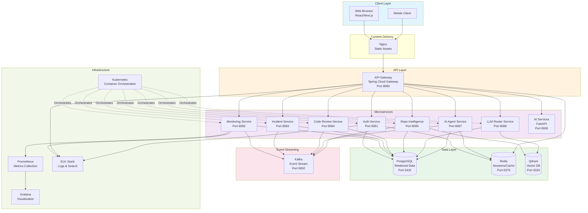
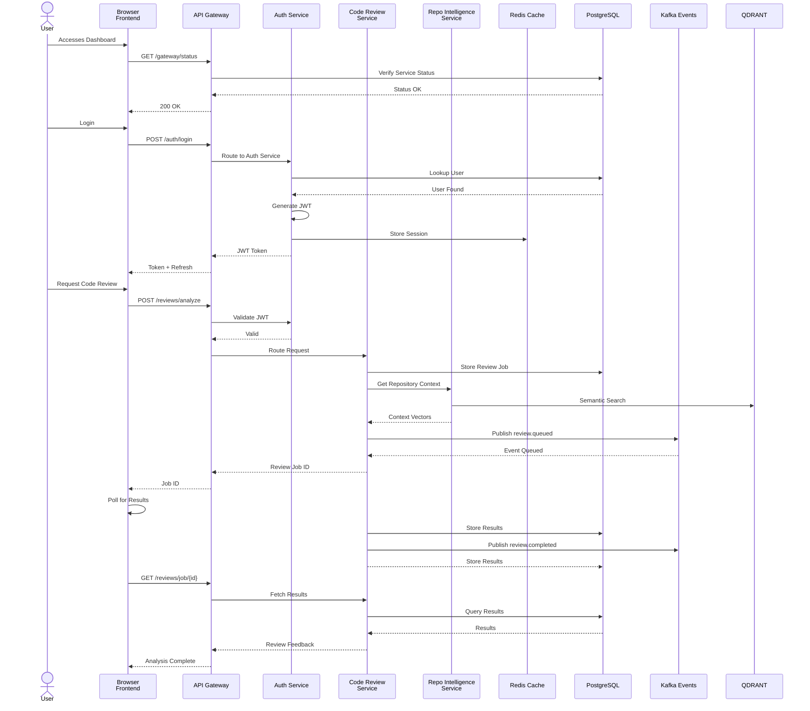
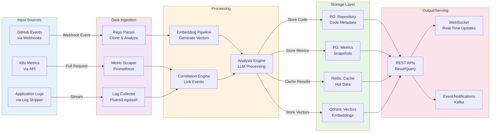
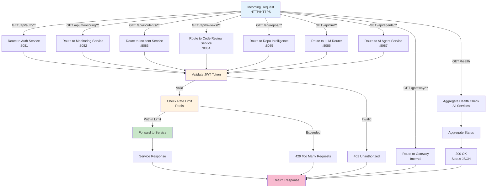
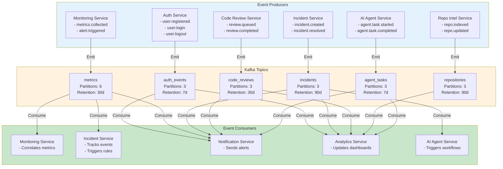
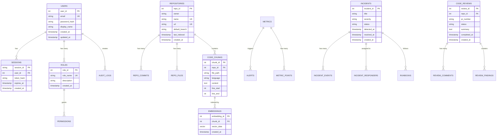
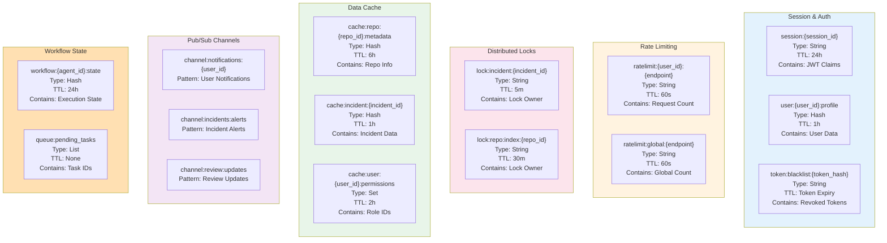
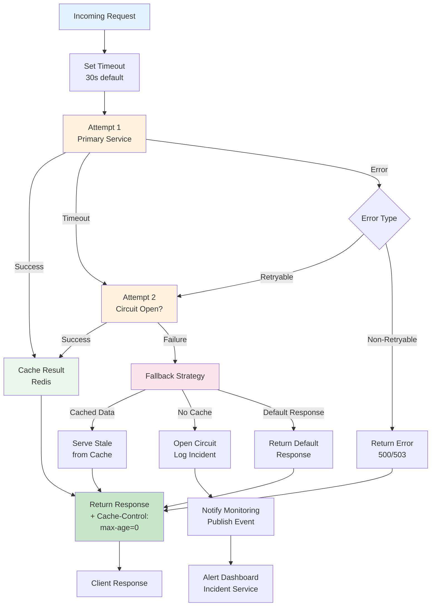

# NexusAI System Diagrams

## 1. High-Level Architecture



## 2. Request Flow and Service Interaction



## 3. Data Flow and Processing Pipeline



## 4. Deployment Topology (Docker Compose / Kubernetes)

```mermaid
graph TB
    subgraph Docker["Docker Compose Development"]
        subgraph Frontend["Frontend"]
            NGINX_DC["Nginx Container<br/>Port 3000"]
        end
        
        subgraph Backend["Backend Services"]
            AUTH_DC["Auth Service<br/>JVM<br/>Port 8081"]
            GW_DC["API Gateway<br/>JVM<br/>Port 8080"]
            MONITOR_DC["Monitoring<br/>JVM<br/>Port 8082"]
            INCIDENT_DC["Incident<br/>JVM<br/>Port 8083"]
            REVIEW_DC["Code Review<br/>JVM<br/>Port 8084"]
            REPO_DC["Repo Intel<br/>JVM<br/>Port 8085"]
            LLM_DC["LLM Router<br/>JVM<br/>Port 8086"]
            AGENT_DC["AI Agent<br/>JVM<br/>Port 8087"]
            AI_DC["AI Services<br/>Python<br/>Port 8000"]
        end
        
        subgraph Database["Data Services"]
            PG_DC["PostgreSQL<br/>Port 5432"]
            REDIS_DC["Redis<br/>Port 6379"]
            QDRANT_DC["Qdrant<br/>Port 6333"]
        end
        
        subgraph Messaging["Messaging"]
            KAFKA_DC["Kafka<br/>Port 9092"]
            ZK_DC["Zookeeper<br/>Port 2181"]
        end
    end
    
    subgraph Kubernetes["Kubernetes Production"]
        subgraph Namespace["default namespace"]
            subgraph Ingress_NS["Ingress"]
                ING["Ingress Controller<br/>Port 80/443"]
            end
            
            subgraph Services_NS["Service Deployments"]
                AUTH_K8S["Auth Deployment<br/>Replicas: 3<br/>CPU: 500m<br/>RAM: 512Mi"]
                GW_K8S["Gateway Deployment<br/>Replicas: 3<br/>CPU: 1000m<br/>RAM: 1Gi"]
                MONITOR_K8S["Monitoring Deploy<br/>Replicas: 2<br/>CPU: 500m<br/>RAM: 512Mi"]
                INCIDENT_K8S["Incident Deploy<br/>Replicas: 2"]
                REVIEW_K8S["Review Deploy<br/>Replicas: 2"]
                REPO_K8S["Repo Deploy<br/>Replicas: 2"]
                LLM_K8S["LLM Deploy<br/>Replicas: 2"]
                AGENT_K8S["Agent Deploy<br/>Replicas: 2"]
                AI_K8S["AI Services Deploy<br/>Replicas: 2"]
            end
            
            subgraph Storage_NS["StatefulSets"]
                PG_K8S["PostgreSQL<br/>Replicas: 1<br/>PVC: 100Gi"]
                REDIS_K8S["Redis<br/>Replicas: 1<br/>PVC: 50Gi"]
                QDRANT_K8S["Qdrant<br/>Replicas: 1<br/>PVC: 100Gi"]
                KAFKA_K8S["Kafka Broker<br/>Replicas: 3<br/>PVC: 100Gi"]
            end
            
            subgraph Monitoring_NS["Observability"]
                PROM_K8S["Prometheus<br/>Scrape: 30s"]
                GRAF_K8S["Grafana<br/>Dashboards"]
                ELK_K8S["ELK Stack<br/>Log Storage"]
            end
        end
        
        subgraph Network["Networking"]
            SVC["Services<br/>Internal DNS"]
            CONFIG_MAP["ConfigMaps<br/>Configuration"]
            SECRETS["Secrets<br/>Credentials"]
        end
    end
    
    ING --> GW_K8S
    GW_K8S --> AUTH_K8S
    GW_K8S --> MONITOR_K8S
    GW_K8S --> INCIDENT_K8S
    GW_K8S --> REVIEW_K8S
    GW_K8S --> REPO_K8S
    GW_K8S --> LLM_K8S
    GW_K8S --> AGENT_K8S
    GW_K8S --> AI_K8S
    
    AUTH_K8S --> PG_K8S
    MONITOR_K8S --> PG_K8S
    INCIDENT_K8S --> PG_K8S
    REVIEW_K8S --> PG_K8S
    REPO_K8S --> PG_K8S
    LLM_K8S --> PG_K8S
    AGENT_K8S --> PG_K8S
    
    AUTH_K8S --> REDIS_K8S
    AGENT_K8S --> REDIS_K8S
    GW_K8S --> REDIS_K8S
    
    REPO_K8S --> QDRANT_K8S
    LLM_K8S --> QDRANT_K8S
    
    MONITOR_K8S --> KAFKA_K8S
    INCIDENT_K8S --> KAFKA_K8S
    REVIEW_K8S --> KAFKA_K8S
    AGENT_K8S --> KAFKA_K8S
    REPO_K8S --> KAFKA_K8S
    
    PROM_K8S --> AUTH_K8S
    PROM_K8S --> GW_K8S
    PROM_K8S --> MONITOR_K8S
    ELK_K8S --> GW_K8S
    ELK_K8S --> AUTH_K8S

    style Docker fill:#eceff1
    style Kubernetes fill:#f5f5f5
    style Frontend fill:#bbdefb
    style Backend fill:#c8e6c9
    style Database fill:#ffe0b2
    style Messaging fill:#f8bbd0
    style Namespace fill:#f0f4c3
    style Storage_NS fill:#dcedc8
```



## 5. API Gateway Routing



## 6. Authentication and Authorization Flow

```mermaid
sequenceDiagram
    actor User
    participant Browser as Browser
    participant Gateway as API Gateway
    participant Auth as Auth Service
    participant DB as PostgreSQL
    participant Redis as Redis
    
    User->>Browser: Login with Credentials
    Browser->>Gateway: POST /auth/login<br/>{email, password}
    Gateway->>Auth: Forward Request
    Auth->>DB: Query User<br/>SELECT * FROM users
    DB-->>Auth: User Record<br/>with bcrypt_hash
    Auth->>Auth: Verify Password<br/>bcrypt.compare()
    alt Password Valid
        Auth->>Auth: Generate JWT<br/>{sub, roles, exp}
        Auth->>Auth: Generate Refresh Token
        Auth->>Redis: SETEX session:{token}<br/>TTL: 24h
        Auth->>DB: Log Login Event
        Auth-->>Gateway: 200 OK<br/>{accessToken, refreshToken, expiresIn}
        Gateway-->>Browser: Set HttpOnly Cookie<br/>+ Response Body
    else Password Invalid
        Auth-->>Gateway: 401 Unauthorized
        Gateway-->>Browser: 401 Unauthorized
    end
    
    Browser->>Gateway: Subsequent Request<br/>Authorization: Bearer {JWT}
    Gateway->>Gateway: Middleware: Extract Token
    Gateway->>Auth: Validate JWT Signature
    Auth->>Auth: Verify JWT<br/>Check expiry, signature
    alt Token Valid
        Auth->>Auth: Extract Claims<br/>{sub, roles}
        Auth->>Redis: Check Revocation
        Redis-->>Auth: Token Not Revoked
        Auth-->>Gateway: 200 OK<br/>Claims + Roles
        Gateway->>Gateway: Load User Context<br/>into Request
        Gateway->>Gateway: Check RBAC Rules<br/>Required Roles?
        alt User Has Role
            Gateway->>Gateway: Allow Request
            Gateway->>Auth: Route to Target Service
        else User Lacks Role
            Gateway-->>Browser: 403 Forbidden
        end
    else Token Invalid/Expired
        Auth-->>Gateway: 401 Unauthorized
        Gateway-->>Browser: 401 Unauthorized<br/>Suggest Refresh
    end
    
    User->>Browser: Token Expired
    Browser->>Gateway: POST /auth/refresh<br/>{refreshToken}
    Gateway->>Auth: Forward Request
    Auth->>Redis: Verify Refresh Token
    Redis-->>Auth: Token Found + Valid
    Auth->>Auth: Issue New Access Token
    Auth-->>Gateway: 200 OK<br/>{accessToken, expiresIn}
    Gateway-->>Browser: New Token

    style User fill:#e3f2fd
    style Auth fill:#fff3e0
    style Gateway fill:#c8e6c9
    style DB fill:#ffe0b2
    style Redis fill:#f8bbd0
```

## 7. Event Streaming and Async Workflows



## 8. Database Entity Relationships



## 9. Cache Layer Strategy (Redis)



## 10. Error Handling and Resilience Pattern



